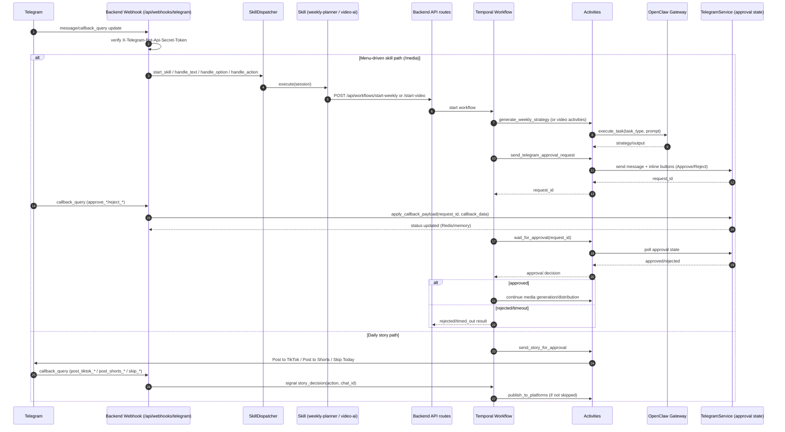

# Telegram → Backend → Skill/Workflow → OpenClaw → Callback (E2E)

Last verified: 2026-03-26 (UTC)

This sequence reflects the **actual runtime path** in the current codebase after wiring fixes.

## Wiring Order Guarantees

1. Webhook authentication and payload parsing happen before any skill/workflow action.
2. Skill sessions are persisted between Telegram steps via `TelegramSkillSessionStore`.
3. Workflow launch happens only after required skill parameters are collected.
4. OpenClaw execution happens inside activities after workflow start, not directly from Telegram handlers.
5. Approval callbacks update `TelegramService` state first; workflows then consume that state through `wait_for_approval`.
6. Story callbacks use Temporal signal (`story_decision`) and remain separate from skill approval callbacks.

## Main Code Paths

- Webhook router: `Project/python_services/api/telegram_webhook.py`
- Skill routing: `Project/python_services/services/skill_dispatcher.py`
- Skills: `Project/python_services/skills/`
- Weekly workflow: `Project/python_services/workflows/weekly_marketing_workflow.py`
- Daily story workflow: `Project/python_services/workflows/daily_story_workflow.py`
- Approval activities: `Project/python_services/activities/approval_activities.py`
- OpenClaw adapter: `Project/python_services/services/openclaw_service.py`
- Telegram approval state: `Project/python_services/services/telegram_service.py`
