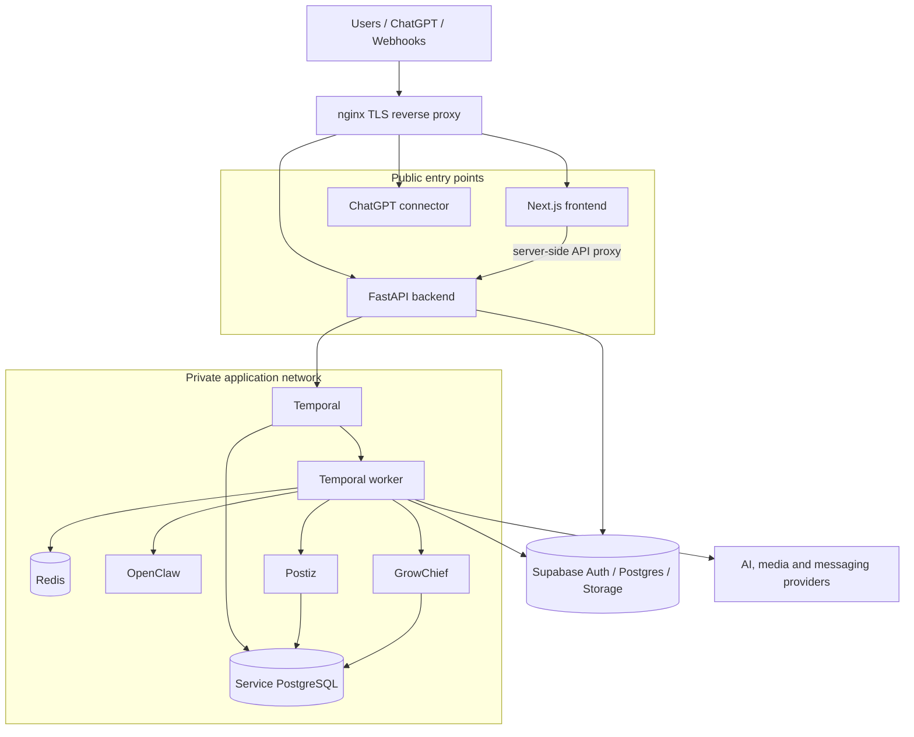
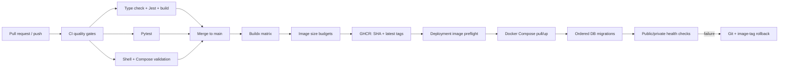

# AI Influencer Factory — DevOps Case Study

[](https://github.com/NganUyen/AI-Influencer-TripC/actions/workflows/ci.yml)
[](https://github.com/NganUyen/AI-Influencer-TripC/actions/workflows/publish-production-images.yml)

AI Influencer Factory is a production-oriented, self-hosted automation platform built with Next.js, FastAPI, Temporal, PostgreSQL, Redis, OpenClaw, Postiz, and GrowChief.

This repository is also a practical DevOps portfolio project. It demonstrates how I approach CI/CD, containerization, release safety, production networking, health monitoring, database migrations, backup and restore, rollback, and day-two operations for a multi-service application.

> Recruiter shortcut: start with the [DevOps portfolio walkthrough](./Docs/DEVOPS_PORTFOLIO.md), then inspect the [CI workflow](./.github/workflows/ci.yml), [production image pipeline](./.github/workflows/publish-production-images.yml), and [operations runbook](./Docs/OPERATIONS_RUNBOOK.md).

## DevOps Highlights

| Capability | Implementation in this repository | Why it matters |
|---|---|---|
| CI quality gates | Frontend type checking, Jest tests and production build; a 74-test critical backend regression suite; shell syntax and Compose validation | Prevents broken application or infrastructure changes from reaching image publication |
| Immutable image delivery | Five application images built with Buildx and tagged with both commit SHA and `latest` in GHCR | Supports traceable releases and deterministic rollback |
| Container engineering | Multi-stage frontend, API and worker images with separate dependency/runtime layers | Reduces runtime surface area and separates API from browser-heavy worker dependencies |
| Production orchestration | 14-service Docker Compose stack with dependency ordering, health checks, restart policies, resource limits and log rotation | Makes service behavior explicit and repeatable |
| Network hardening | Public traffic terminates at nginx; internal services bind to `127.0.0.1` or remain private on the Docker network | Minimizes externally exposed services |
| Release safety | Published-image preflight, pull-first deployment, opt-in local build, database migration script and post-deploy smoke checks | Fails early when an artifact or dependency is unavailable |
| Recovery | Database and browser-profile backup/restore plus Git/image-tag rollback automation | Provides documented recovery paths instead of manual improvisation |
| Operations | Health checks, provider probes, Telegram/OpenClaw diagnostics, resource monitor and scheduled Docker cleanup | Covers routine operations after deployment |
| Configuration security | Production settings reject placeholder secrets, wildcard credentialed CORS and invalid storage configuration | Converts critical configuration assumptions into startup checks |

Current repository evidence:

- 14 production services
- 5 application images published by a build matrix
- 8 container health checks
- restart and log-rotation policies across all 14 production services
- 10 resource-limit blocks
- 11 VPS automation scripts
- 532 backend test cases collected by pytest, with 74 critical-path backend tests in the release gate
- 50 frontend test cases

## Runtime Architecture



Only the frontend, backend, and connector are intended as public entry points. Temporal, Redis, OpenClaw, Postiz, GrowChief, and PostgreSQL remain private or localhost-bound in production.

## Delivery Pipeline



The production path defaults to registry-backed images. Building directly on the VPS is an explicit emergency option, not the normal release path.

## Product Overview

The application provides:

- a customer workspace for authentication, brand onboarding, personas, campaign review and video creation
- an internal operations console for workflow monitoring, approvals, retries, analytics and quota visibility
- Temporal workflows for strategy, media generation, approvals, publishing and engagement
- a separate constrained ChatGPT/OpenClaw connector
- persisted application state in Supabase PostgreSQL and media in Supabase Storage

The strongest implemented path is the review-first Create Video workflow:

```text
Website validation
  -> shared script contract
  -> persona-localized plans
  -> customer approval
  -> Temporal workflow
  -> browser capture + voice + talking head
  -> FFmpeg assembly
  -> review and publishing
```

## Repository Map

```text
.
|-- .github/workflows/             CI and production image publication
|-- deploy/nginx/                  TLS reverse-proxy configurations
|-- deploy/vps/                    Deploy, migrate, health, backup and rollback scripts
|-- docker/                        Custom service images and health-check helpers
|-- Docs/                          Architecture, operations and integration documentation
|-- Project/
|   |-- app/                       Next.js App Router application
|   |-- components/                Customer and operator interfaces
|   |-- python_services/           FastAPI, Temporal worker, workflows and tests
|   `-- supabase/                  Schema snapshots and ordered migrations
|-- docker-compose.yml             Local development stack
`-- docker-compose.production.yml  Production stack
```

## Run Locally

Prerequisites: Node.js 20, Python 3.11, and Docker Compose.

```bash
cp Project/.env.example Project/.env.local
docker compose up -d --build
```

Main local endpoints:

- frontend: `http://localhost:3000`
- backend and OpenAPI: `http://localhost:8000/docs`
- Temporal UI: `http://localhost:8080`
- ChatGPT connector: `http://localhost:8010`

For smaller development modes and environment setup, use [Start Here](./Docs/START_HERE.md).

## Production Operations

The standard deployment sequence is intentionally explicit:

```bash
PROJECT_ENV_FILE=./Project/.env.production \
IMAGE_TAG=<published-commit-sha> \
./deploy/vps/deploy-production.sh

PROJECT_ENV_FILE=./Project/.env.production \
./deploy/vps/apply-db-migrations.sh

PROJECT_ENV_FILE=./Project/.env.production \
./deploy/vps/healthcheck.sh
```

Recovery commands and operational caveats are documented in the [Operations Runbook](./Docs/OPERATIONS_RUNBOOK.md).

## Documentation

- [DevOps Portfolio Walkthrough](./Docs/DEVOPS_PORTFOLIO.md)
- [Architecture](./Docs/ARCHITECTURE.md)
- [Operations Runbook](./Docs/OPERATIONS_RUNBOOK.md)
- [Environment Reference](./Docs/ENVIRONMENT_REFERENCE.md)
- [Workflows and Automation](./Docs/WORKFLOWS_AND_AUTOMATION.md)
- [Integrations](./Docs/INTEGRATIONS.md)
- [Database Model](./Docs/db.md)
- [Repository Map](./Docs/REPOSITORY_MAP.md)

## Honest Scope

This repository demonstrates a VPS and Docker Compose operating model rather than Kubernetes or a public-cloud managed platform. Deployment is operator-triggered after image publication. The full historical backend suite still contains stale media and Telegram tests, so the current release gate runs a stable 74-test critical-path selection while that debt is reconciled. Logical next steps are infrastructure as code, environment-protected automated deployment, centralized metrics/log aggregation, vulnerability scanning, full-suite reconciliation, and tested recovery objectives.
